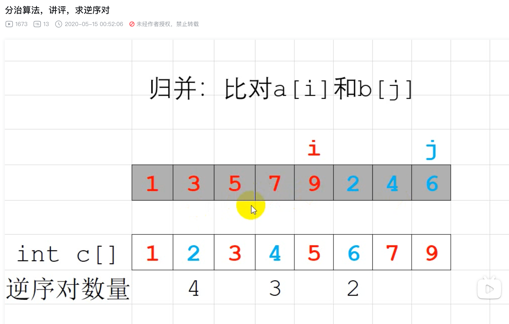

https://www.bilibili.com/video/BV1tC4y1H7Bx/?spm_id_from=333.337.search-card.all.click&vd_source=d942722ad3983de914a6eae0f9bc074c



#### 思路
##### 算法精髓

比较 1 3 5 7 9 2 4 6
左半部分 1 3 5 7 有序
右半部分 2 4 6 有序

i和j分别从开始位置右移比较
如果i所在的值比j大，那么i之后的左半部分都是j的逆序对，可以快速求出数量

切分成左右两个部分，然后比较的算法我们学过归并排序，似乎可以用归并排序来解这个问题
加快求解速度


# 逆序对

## 题目描述

猫猫 TOM 和小老鼠 JERRY 最近又较量上了，但是毕竟都是成年人，他们已经不喜欢再玩那种你追我赶的游戏，现在他们喜欢玩统计。

最近，TOM 老猫查阅到一个人类称之为“逆序对”的东西，这东西是这样定义的：对于给定的一段正整数序列，逆序对就是序列中 $a_i>a_j$ 且 $i<j$ 的有序对。知道这概念后，他们就比赛谁先算出给定的一段正整数序列中逆序对的数目。注意序列中可能有重复数字。

**Update:数据已加强。**

## 输入格式

第一行，一个数 $n$，表示序列中有 $n$个数。

第二行 $n$ 个数，表示给定的序列。序列中每个数字不超过 $10^9$。

## 输出格式

输出序列中逆序对的数目。

## 样例 #1

### 样例输入 #1

```
6
5 4 2 6 3 1
```

### 样例输出 #1

```
11
```

## 提示

对于 $25\%$ 的数据，$n \leq 2500$

对于 $50\%$ 的数据，$n \leq 4 \times 10^4$。

对于所有数据，$n \leq 5 \times 10^5$

请使用较快的输入输出

应该不会 $O(n^2)$ 过 50 万吧 by chen_zhe